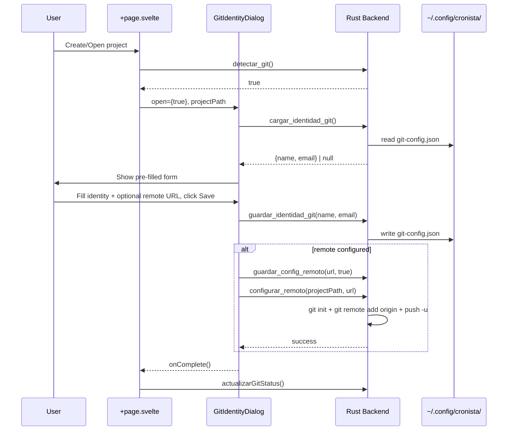
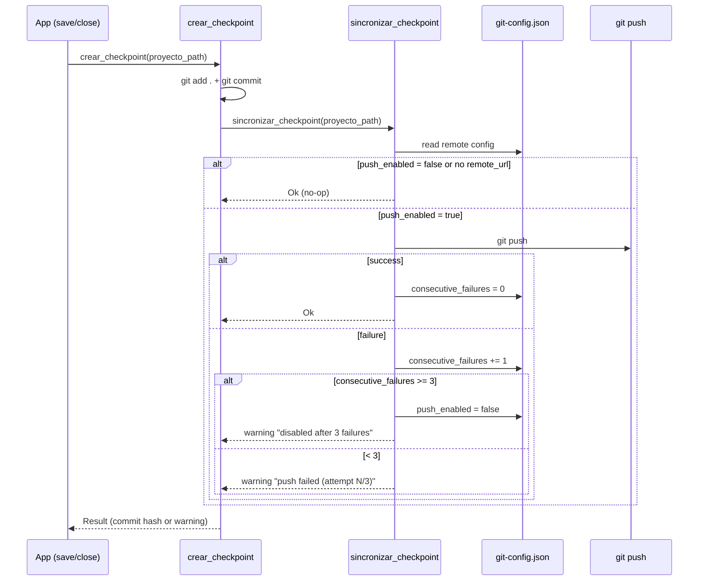
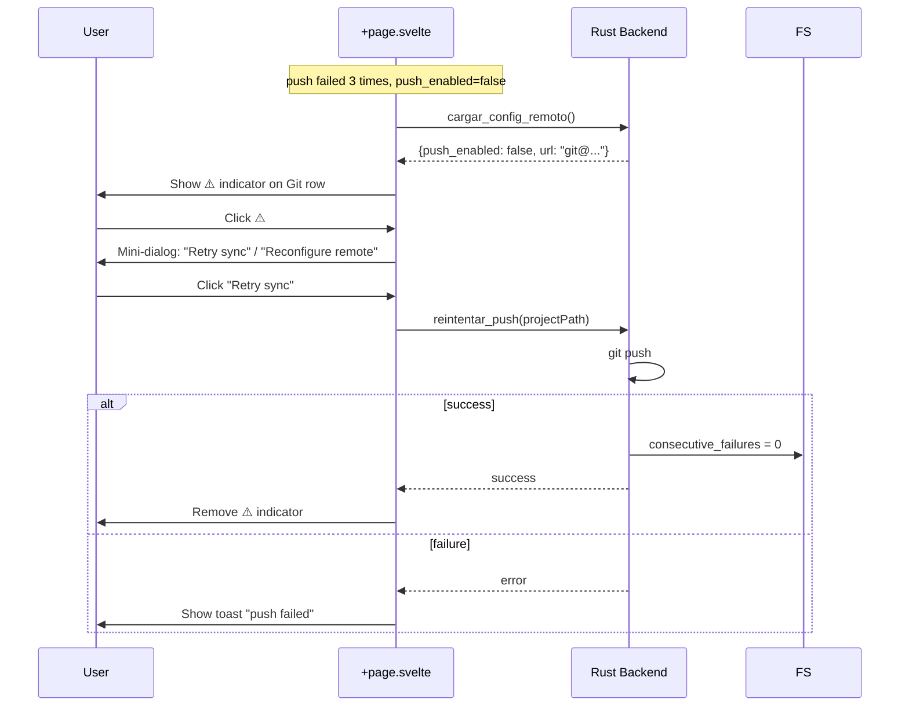

# Design: Git Identity & Remote Sync

## Technical Approach

Replace the hardcoded "Cronista" Git identity and per-project author config with a persistent, cross-project identity stored in Tauri's `app_config_dir`. Add optional SSH-only remote sync with auto-push on checkpoints, governed by a 3-strike failure policy. The identity dialog is a single reusable Svelte component that replaces the inline Git init modal in `+page.svelte`.

## Architecture Decisions

| Decision | Choice | Rationale |
|----------|--------|-----------|
| Config storage | Global `app_config_dir()/cronista/git-config.json` | Cross-project reuse; single source of truth; `app_config_dir` is Tauri's platform-standard config path |
| Remote transport | SSH only (reject `https://`) | HTTPS requires credential management (credential helper, token storage) — out of scope; SSH key setup is a one-time user responsibility documented in dialog |
| UI flow | Single dialog (not wizard) | Only 2 optional sections (identity required, remote optional); wizard overkill for 2-3 fields |
| Failure policy | 3 consecutive failures → auto-disable | Balances user awareness with noise: transient network issues are tolerated, persistent failure disables non-intrusively |
| Warning indicator | Toolbar icon (⚠️) on Git status row | Non-intrusive, contextual — only shown when remote WAS configured, doesn't disrupt writing workflow |

## Data Flow

### 1. Project Creation with Git Identity



### 2. Auto-Push on Checkpoint



### 3. 3-Strike Disable & Recovery



## File Changes

| File | Action | Description |
|------|--------|-------------|
| `src-tauri/src/lib.rs` | Modify | Add 6 Tauri commands (`cargar_identidad_git`, `guardar_identidad_git`, `cargar_config_remoto`, `guardar_config_remoto`, `configurar_remoto`, `reintentar_push`); add internal helper `sincronizar_checkpoint`; extend `crear_checkpoint` to call sync; extend `inicializar_git` with optional identity params; register commands in `invoke_handler![]` |
| `src/lib/components/GitIdentityDialog.svelte` | Create | Single-dialog component: identity fields + optional remote section with SSH validation, calls `cargar_identidad_git` on mount for pre-fill, saves via `guardar_identidad_git` + `guardar_config_remoto` + `configurar_remoto` |
| `src/routes/+page.svelte` | Modify | Replace inline git init modal (lines 1743-1797) with `<GitIdentityDialog>`; add `gitRemoteWarning` state + ⚠️ toolbar indicator on git status row; add retry/reconfigure mini-dialog on ⚠️ click; surface push-failure warnings from checkpoint responses |
| `src/lib/tauri.ts` | Modify | Add TypeScript wrappers: `cargarIdentidadGit`, `guardarIdentidadGit`, `cargarConfigRemoto`, `guardarConfigRemoto`, `configurarRemoto`, `reintentarPush` |
| `src/lib/i18n.svelte.ts` | Modify | Add ~12 new keys: `git.identity*`, `git.remote*`, `git.push*`, `git.toolbar*` in both ES and EN blocks |

## Global Config Schema

```json
{
  "schema_version": 1,
  "identity": { "name": "Miguel de Cervantes", "email": "cervantes@literatura.es" },
  "remote": { "url": "git@github.com:user/repo.git", "push_enabled": true, "consecutive_failures": 0 }
}
```

Path: `{app_config_dir}/cronista/git-config.json`. Created on first save, read on load. `schema_version` enables future migration.

## 3-Strike Logic (Rust internal)

`fn sincronizar_checkpoint(project_path: &str) -> Result<String, String>` (internal helper, NOT a Tauri command):

1. Read `git-config.json`. If `!push_enabled` or no `url` → return `Ok` (no-op).
2. Run `git push`. On success → set `consecutive_failures = 0`, save config, return `Ok`.
3. On failure → increment `consecutive_failures`. If `>= 3` → set `push_enabled = false`, save config, return warning string.
4. Otherwise return warning with attempt count.

`reintentar_push` (Tauri command): runs `git push`, resets counter to 0 on success.

## Testing Strategy

| Layer | What to Test | Approach |
|-------|-------------|----------|
| Rust unit | `sincronizar_checkpoint` counter logic, config read/write | `#[cfg(test)]` with temp dir for config file; mock `system_command` or use real git in temp repo |
| Rust unit | Config schema serialization/deserialization | Serde round-trip tests |
| Rust unit | `guardar_identidad_git` / `cargar_identidad_git` | Temp dir + write + read back |
| Rust unit | `guardar_config_remoto` / `cargar_config_remoto` | Temp dir + write + read back |
| Rust integration | `configurar_remoto` with temp git repo | Real `git init` in temp dir, verify `git remote -v` output |
| Frontend unit | `GitIdentityDialog` component rendering | Vitest + Svelte Testing Library: mount component, verify inputs render, verify SSH rejection message |
| E2E | Full identity+remote flow | Manual: create project → fill dialog → verify `git-config.json` → verify `git log` author |

## Migration / Rollout

No data migration required — the global config file is purely additive. If the file does not exist, `cargar_identidad_git` returns `null` and the dialog shows empty fields with language-aware presets (`git.defaultName` / `git.defaultEmail`). To roll back, delete `git-config.json` and revert to `inicializar_git_con_autor` flow.

## Open Questions

- [ ] Should `sincronizar_checkpoint` run in a tokio task to avoid blocking the close handler? (Current `do_checkpoint` is sync in `tauri::async_runtime::spawn` — same pattern likely fine.)
- [ ] Confirm `app_config_dir` resolves correctly on all three platforms in Tauri v2 context (tested only on Linux so far).
